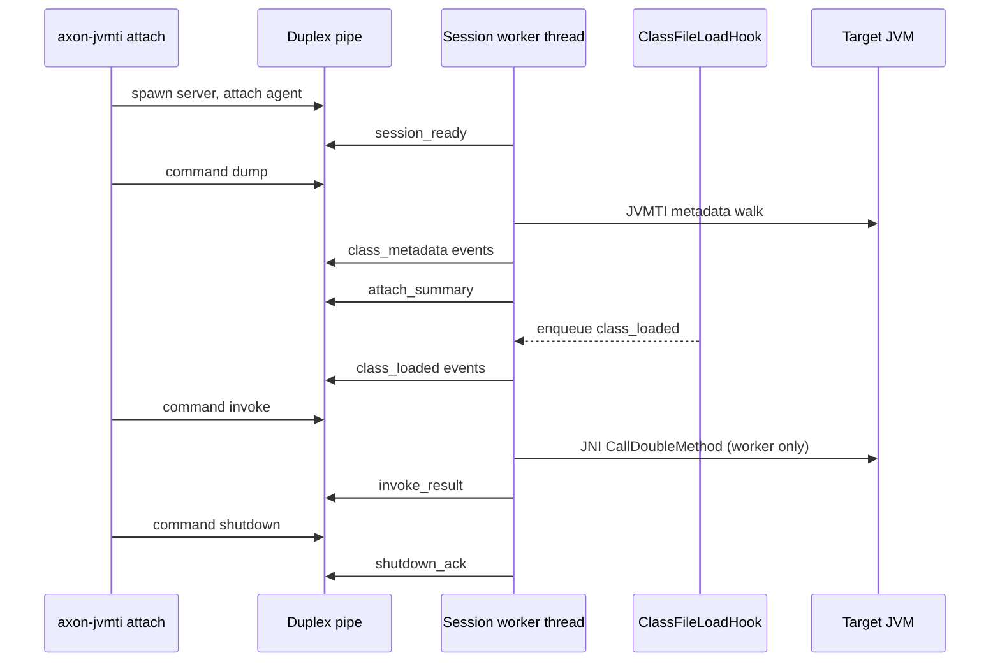

# JVMTI Phase 2 Execution Architecture

Answers reviewer Q2: how JNI `Call*Method` and action routing work in axon-jvmti.

## Why persistent session

Snapshot attach (`mode=snapshot`, default) runs one metadata dump and exits. Phase 2 uses **`mode=persistent`**: the agent returns from `Agent_OnAttach` immediately and keeps a **worker thread** alive for commands over duplex IPC.

Benefits:

- Attach once, many commands (dump, invoke, shutdown)
- Avoids repeated agent load cost
- Enables streaming `class_loaded` events (Q3)

## Thread model



**Safety rule:** all JNI `Call*Method` calls run on the **session worker thread only**. JVMTI callbacks (`ClassFileLoadHook`) only enqueue events — no JNI/JVMTI in callbacks.

## IPC protocol (duplex NDJSON)

**Host → Agent (commands):**

```json
{"type":"command","id":"1","op":"dump","include":"com.example","exclude":"org.springframework"}
{"type":"command","id":"2","op":"invoke","class":"com.example.demo.Order","method":"getTotal","sig":"()D","timeout_ms":5000}
{"type":"command","id":"3","op":"shutdown"}
```

**Agent → Host (events):**

```json
{"type":"event","op":"session_ready","mode":"persistent"}
{"type":"event","op":"class_metadata","class":"com.example.demo.Order","methods":[...]}
{"type":"event","op":"attach_summary","classes_scanned":8421,"classes_emitted":12,"elapsed_ms":1340}
{"type":"event","op":"class_loaded","class":"com.example.dynamic.LateLoaded"}
{"type":"event","op":"invoke_result","id":"2","success":true,"value":99.5}
{"type":"event","op":"error","id":"2","code":"java_exception","message":"..."}
```

## Invoke pipeline

1. **Host** — `JvmActionExecutor::execute_invoke` sends invoke command; awaits `invoke_result` or `error`.
2. **Agent session** — builds allowlist from prior dump (or invoke command entry); validates method.
3. **Agent invoke.rs** — tags instances if needed, resolves receiver via `GetObjectsWithTags`, maps args (primitives + `String` Phase 2.0), calls `Call*MethodA` via JNI vtable.
4. Java exceptions → structured JSON error (`ExceptionDescribe` + clear), never propagated to crash JVM.

## CLI

```powershell
# Persistent dump + stats
cargo run -p axon-jvmti --bin attach -- --pid $pid --persistent --include com.example.demo --stats

# Invoke getTotal() on live Order instance
cargo run -p axon-jvmti --bin attach -- --pid $pid --persistent --include com.nelieo `
  --invoke-class com.nelieo.probe.Order --invoke-method getTotal --invoke-sig "()D"

# Dynamic hooks listen
cargo run -p axon-jvmti --bin attach -- --pid $pid --persistent --loadhook --include com.example --skip-dump --listen-ms 15000
```

## Watcher integration path (Phase 2.1)

See [jvmti-watcher-integration.md](./jvmti-watcher-integration.md).

- `ProbeLifecycle::probe_jvm()` holds a persistent `JvmSession` per PID
- Warm cycles with `AXON_JVM_LOADHOOK=1`: drain `class_loaded` events and merge into state cache without full re-attach
- `class_loaded` → `StateChangeNotification` with `objects.{className}` paths
- API dispatch: `execute_jvm` via `WatcherHandle::get_jvm_session(pid)`

## Phase 2.0 additions (v2)

### Object registry

Agent `registry.rs` assigns stable `object_id` values (`obj-N`) during instance walk. Invoke commands may reference `object_id` instead of raw JNI tags.

### Invoke policy

`policy.rs` blocks `System.exit`, `Runtime` manipulation, and classloader defineClass. Allowlist enforced from last metadata dump.

### Hook backpressure

Bounded queue (10k events) in agent session; overflow counted in `attach_summary.hook_events_dropped`.

### Linux IPC

Unix domain sockets at `/tmp/axon-jvmti-{pid}.sock` (+ `.sock.cmd`) for duplex NDJSON on Linux CI.

### E2E scripts

| Script | Validates |
|--------|-----------|
| `scripts/jvmti-probe-e2e.ps1` | State/metadata within 30s SLA |
| `scripts/jvmti-cli-invoke-e2e.ps1` | `axon jvm invoke` end-to-end |
| `scripts/jvmti-invoke-test.ps1` / `.sh` | Persistent invoke + policy deny |
| `scripts/jvmti-loadhook-test.ps1` | Dynamic class_loaded streaming |

## Artifacts mapping triunex questions

| Question | Artifact |
|----------|----------|
| Q1 Enterprise stress | `scripts/jvmti-enterprise-stress.ps1`, `docs/jvmti-enterprise-stress-results.md` |
| Q2 Phase 2 execution | This document, `crates/axon-jvmti-agent/src/invoke.rs`, `crates/axon-jvmti/src/action.rs` |
| Q3 Dynamic hooks | `crates/axon-jvmti-agent/src/loadhook.rs`, `scripts/jvmti-loadhook-test.ps1` |

## Protocol v3 (Phase 3 extensions)

**New commands:**

```json
{"type":"command","id":"ri-1","op":"read_instances","object_ids":["obj-1"]}
{"type":"command","id":"wf-1","op":"watch_fields","classes":["com.nelieo.probe.Order"],"fields":["total"]}
{"type":"command","id":"uw-1","op":"unwatch_fields","watch_id":"watch-1"}
```

**New events:**

```json
{"type":"event","op":"object_snapshot","class":"com.nelieo.probe.Customer","object_id":"obj-1","values":{"email":"ada@example.com"},"nodes_walked":12,"truncated":false}
{"type":"event","op":"field_changed","class":"com.nelieo.probe.Order","field":"total","before":99.5,"after":123.45,"ts_ms":1718891234567}
{"type":"event","op":"instrument_applied","class":"com.nelieo.probe.Order","transform_ms":4,"probe_count":8}
{"type":"event","op":"instrument_skipped","class":"java.util.HashMap","reason":"bootstrap_class"}
{"type":"event","op":"telemetry_overflow","dropped":42,"window_ms":1000}
```

**Thread model note:** `ClassFileLoadHook` may call JNI for ASM transforms synchronously (required by JVMTI hook contract). All other JNI graph walks, IPC writes, and invoke calls remain on the session worker thread. Telemetry callbacks enqueue only.

See [jvmti-phase3-telemetry.md](./jvmti-phase3-telemetry.md) for full Phase 3 spec.
