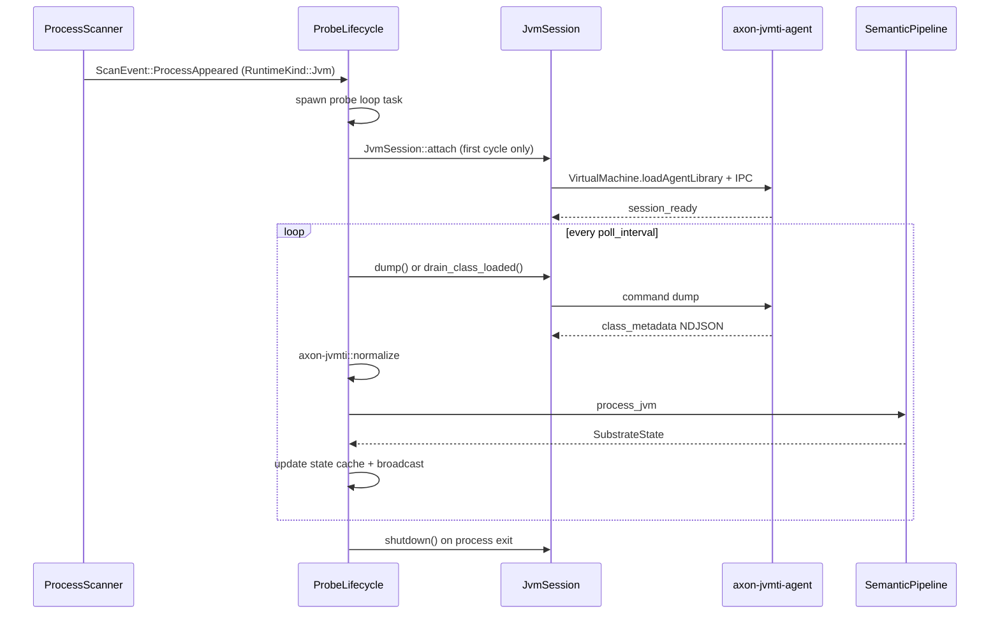

# JVMTI Watcher Integration

How `axon-watcher` probes JVM processes and maintains live `SubstrateState`.

## Lifecycle overview

## Session ownership

| Component | Owns |
|-----------|------|
| `ProbeLifecycle` | `JvmSessionSlot` (`Arc<parking_lot::Mutex<Option<JvmSession>>>`) per PID |
| `JvmSession` | Duplex IPC pipes to the in-process agent worker |
| `JvmProbeAnchor` | Cached class/action counts + filter config for warm-path telemetry |

**Attach once per PID.** The watcher does not re-attach on every poll cycle. On pipe failure the session slot is cleared and the next cycle performs a cold re-attach with exponential backoff (via existing lifecycle error handling).

## Poll loop behavior

1. **First cycle (cold):** acquire `cold_probe_sem`, `JvmSession::attach`, `dump`, normalize, semantic pipeline.
2. **Subsequent cycles (warm):** reuse session, `dump` (or `drain_class_loaded` when `AXON_JVM_LOADHOOK=1`).
3. **Action gate:** probe loop holds READ lock; action dispatcher (PR #5) will hold WRITE lock during invoke.

## Configuration

| Source | Effect |
|--------|--------|
| Process cmdline | `include=` filter derived from main class package |
| `AXON_JVM_LOADHOOK=1` | Enable ClassFileLoadHook streaming between dumps |
| `AXON_JVMTI_AGENT` | Override agent library path |
| `JAVA_HOME` | Required for attach loader JVM |

Default include filter falls back to `com.nelieo` when cmdline parsing finds no package.

## SSF mapping

See `crates/axon-jvmti/src/normalizer.rs`:

- `ClassDescriptor.class` → `state.objects` key (dotted name)
- Fields → object `fields` map with JVM type signatures
- Methods → `ActionSchema` with `internal_target` = `jvm:Class#methodSig`
- Getters classified as `Reversibility::Read`

## Related artifacts

- Phase 2 protocol: [jvmti-phase2-execution.md](./jvmti-phase2-execution.md)
- Probe API: `crates/axon-jvmti/src/session.rs`
- Watcher entry: `crates/axon-watcher/src/lifecycle.rs::probe_jvm`
